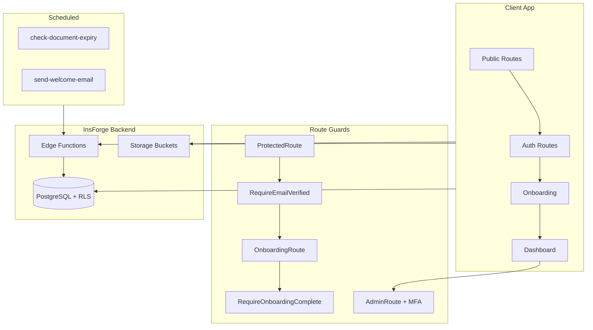

# Phase 7 – Final Production-Readiness Report

This document summarizes the key schema/RLS changes, currency/unit standardizations, mock-to-real replacements, admin hardening, UX improvements, issue-to-fix mapping, remaining backend needs, risk assessment, and go-live checklist.

---

## 1. Summary of Changes

### Schema and RLS Changes

| Change | Location | Description |
|--------|----------|-------------|
| **Blog posts table** | [db/migrations/add-blog-posts.sql](../db/migrations/add-blog-posts.sql) | `blog_posts` table with slug, title, excerpt, content_markdown, cover_image_url, category, author_name, reading_time_minutes, status, SEO fields, published_at |
| **Blog anon policy fix** | [db/migrations/fix-blog-posts-anon-policy.sql](../db/migrations/fix-blog-posts-anon-policy.sql) | `GRANT USAGE ON SCHEMA public TO anon`, `GRANT SELECT ON blog_posts TO anon`, policy for public read of published posts |
| **RLS recursion fix** | [db/migrations/fix-rls-recursion.sql](../db/migrations/fix-rls-recursion.sql) | `user_owns_account()` and `user_is_account_member()` as `SECURITY DEFINER`; policies on accounts/account_members updated to avoid infinite recursion |
| **Consents (POPIA)** | [db/schema.sql](../db/schema.sql) | `consents` table with RLS; users select/insert own consents |
| **Onboarding events** | [db/schema.sql](../db/schema.sql) | `onboarding_events`, `onboarding_progress` with `step_data` JSONB; RLS for user-scoped access |
| **Admin enhancements** | [db/schema.sql](../db/schema.sql) | `profiles.account_status`, `flagged_at`, `flagged_reason`; `auth_users_view`, `admin_vehicles_view`, `admin_dashboard_metrics` RPC; `admin_set_account_status`, `admin_resend_verification`, `admin_set_flagged` RPCs |
| **Platform admins** | [db/schema.sql](../db/schema.sql) | `platform_admins` table; RLS allows authenticated read for admin checks |

### Currency and Unit Standardizations

| Area | Implementation |
|------|----------------|
| **Currency** | ZAR default in `profiles`, `maintenance_logs`, `fuel_logs`; amounts in cents; [db/migrations/2026-03-12-set-zar-defaults.sql](../db/migrations/2026-03-12-set-zar-defaults.sql) backfills NULL/USD to ZAR |
| **Formatting** | [src/lib/formatters.ts](../src/lib/formatters.ts): `formatCurrencyZAR`, `formatCurrencyZAROrDash` via `Intl.NumberFormat('en-ZA')` |
| **Units** | `mileage_unit: 'km'`, `fuel_unit: 'litres'`, `measurement_system: 'metric'` defaults in bootstrap and onboarding |
| **Display** | `formatKm`, `formatLitres`, `formatDistanceKm`; FuelTracker/MileageTracker switch labels by measurement system |

### Mock-to-Real Replacements

| Feature | Status | Notes |
|---------|--------|-------|
| **Dashboard overview** | Real | [src/services/dashboardOverview.ts](../src/services/dashboardOverview.ts) – vehicles, alerts, maintenance, fuel, invoices, documents from DB |
| **Vehicles, maintenance, fuel** | Real | [vehicles.ts](../src/services/vehicles.ts), [maintenance.ts](../src/services/maintenance.ts), [fuel.ts](../src/services/fuel.ts) – full CRUD against DB |
| **Documents** | Real | [documents.ts](../src/services/documents.ts) – InsForge storage + `documents` table |
| **Billing** | Real | [billing.ts](../src/services/billing.ts) – `subscriptions`, `plans`, `billing_invoices` |
| **Contact form** | Real | Inserts into `contact_messages` |
| **Blog** | Real | [blog.ts](../src/services/blog.ts) – `blog-posts-public` edge function |
| **Admin user metrics** | Real | [adminMetrics.ts](../src/services/adminMetrics.ts) – `admin_dashboard_metrics` RPC |
| **Admin charts** | Mock | [AdminDashboard.tsx](../src/pages/admin/AdminDashboard.tsx) – revenue trend, signup volume, platform health (99.99%, 45ms, etc.) are placeholders |

### Admin Hardening

| Component | Implementation |
|-----------|----------------|
| **Route guard** | [AdminRoute.tsx](../src/routes/AdminRoute.tsx) – checks `VITE_ADMIN_EMAILS` + `platform_admins`, enforces MFA |
| **MFA** | [adminMfa.ts](../src/services/adminMfa.ts), [AdminMfaSetup.tsx](../src/pages/admin/AdminMfaSetup.tsx), [AdminMfaVerify.tsx](../src/pages/admin/AdminMfaVerify.tsx) – TOTP enrollment and verification |
| **Audit logs** | [auditLog.ts](../src/services/auditLog.ts), [AuditLogsPage.tsx](../src/pages/admin/AuditLogsPage.tsx) – admin actions logged to `audit_logs` |
| **User management** | [UserManagement.tsx](../src/pages/admin/UserManagement.tsx) – suspend/unsuspend, flag, resend verification via edge functions |

### UX Improvements

| Area | Implementation |
|------|----------------|
| **Loading states** | [pageSkeletons.tsx](../src/components/states/pageSkeletons.tsx) – DashboardHome, MyVehicles, MaintenanceLog, FuelTracker, Documents skeletons |
| **Error handling** | [ErrorState.tsx](../src/components/states/ErrorState.tsx) with retry; [ErrorBoundary.tsx](../src/components/ErrorBoundary.tsx); [authErrors.ts](../src/lib/authErrors.ts) for auth errors |
| **Empty states** | [EmptyState.tsx](../src/components/ui/EmptyState.tsx) used across Documents, BillingSubscription, MaintenanceLog, MyVehicles, FuelTracker |
| **Forms** | `Input` with `error` prop; `ConfirmDialog` with `loading`; validation in Login, SignUp, Contact, MaintenanceLog, FuelTracker, VehicleForm, OnboardingFlow, ProfileSettings |

---

## 2. Initial Issues to Implemented Fixes Mapping

| Initial Issue | Implemented Fix |
|---------------|-----------------|
| **Mock data** | Dashboard overview, vehicles, maintenance, fuel, documents, billing, contact, blog, admin user metrics use real DB/API; admin charts (revenue, signups, platform health) remain placeholders |
| **Localization gaps** | SA defaults: ZAR, km, litres, `Africa/Johannesburg`, country ZA; locales en/af/zu/xh in onboarding; `en-ZA` for dates/numbers; phone validation with SA hint; province/postal_code in profiles with UI in onboarding and settings |
| **Admin feature gaps** | User management (search, filters, suspend, flag, resend verification), audit logs, MFA, admin metrics RPC, admin views; Content Management and Support Tickets are placeholders |
| **Client feature gaps** | Full dashboard, vehicles, maintenance, fuel, documents, reports, billing, onboarding; no workshop booking flow |
| **Schema mismatches** | RLS recursion fixed; blog anon policy fixed; ZAR migration applied; consent, onboarding_events, onboarding_progress, admin views/RPCs added |

---

## 3. Remaining Backend/Schema Needs

### Still-Missing Features Requiring Backend Support

| Feature | Current State | Backend Need |
|---------|---------------|--------------|
| **True observability metrics** | Admin Platform Health (uptime, latency, requests, error rate) uses hardcoded sample values | Wire to InsForge/third-party observability (e.g. Datadog, Prometheus, custom metrics API) |
| **Ticketing system** | [SupportTickets.tsx](../src/pages/admin/SupportTickets.tsx) – "Support tickets coming soon" placeholder | Schema for tickets, RLS, edge functions for create/update/assign |
| **Richer CMS** | [ContentManagement.tsx](../src/pages/admin/ContentManagement.tsx) – placeholder | Blog management UI, draft/publish workflow, media library; blog_posts already exists |
| **Live billing/revenue** | Admin revenue chart is placeholder | Stripe/billing webhook integration, aggregation views or RPC for revenue by period |
| **Real signup analytics** | Admin signup chart is placeholder | Analytics pipeline or RPC for signups by day/week |

### SA Localization Migration

The migration [db/migrations/2026-03-12-add-sa-localization-fields.sql](../db/migrations/2026-03-12-add-sa-localization-fields.sql) adds `province` and `postal_code` to `profiles`. Implemented:

- **province**: Dropdown with SA provinces (EC, FS, GP, KZN, LP, MP, NC, NW, WC).
- **postal_code**: Free-text input; SA postal codes are 4 digits.
- [OnboardingFlow.tsx](../src/pages/onboarding/OnboardingFlow.tsx) and [ProfileSettings.tsx](../src/pages/dashboard/ProfileSettings.tsx) include these fields. Run the migration before deploying.

---

## 4. Risk and Readiness Assessment

### Residual Risks and Assumptions

| Risk/Assumption | Mitigation |
|-----------------|------------|
| **InsForge cron/email config** | Document expiry and welcome email rely on InsForge schedules. Ensure `check-document-expiry` and `send-welcome-email` are deployed and scheduled per [PHASE_F.md](PHASE_F.md); verify `CRON_SECRET` and `SENDGRID_API_KEY` are set |
| **Third-party availability** | SendGrid for welcome emails; Stripe for billing (if used). Have fallback/retry logic; monitor delivery and webhook failures |
| **MFA dependency** | Admin MFA requires InsForge auth MFA APIs (`auth.mfa.enroll`, `auth.mfa.challenge`, etc.). Confirm InsForge supports these before go-live |
| **Rate limiting** | Per [PHASE_D.md](PHASE_D.md), rate limiting must be configured on InsForge backend (signup, login, password reset). Not implemented in frontend |
| **Platform admins RLS** | All authenticated users can read `platform_admins`. Writes should go through protected RPCs; no `add_platform_admin` RPC yet – manual SQL for new admins |
| **Company Admin scoping** | Company Admins currently get full `/admin/*` access; restricting to their `account_id` is a future enhancement |

### Go-Live Checklist

#### Environment Variables

- [ ] `VITE_INSFORGE_URL` – InsForge project URL
- [ ] `VITE_INSFORGE_ANON_KEY` – Public anon key
- [ ] `VITE_ADMIN_EMAILS` – Comma-separated system admin emails (at least one for bootstrap)
- [ ] InsForge secrets (for edge functions): `INSFORGE_URL`, `INSFORGE_ANON_KEY`, `INSFORGE_SERVICE_ROLE_KEY`
- [ ] `SENDGRID_API_KEY` (if using welcome emails)
- [ ] `CRON_SECRET` (if using cron Bearer auth for scheduled functions)

#### RLS Tests

- [ ] Unauthenticated: cannot read accounts, profiles, account_members, vehicles, maintenance_logs, fuel_logs, documents, consents
- [ ] Authenticated user A: cannot see user B's accounts, vehicles, or logs
- [ ] Anon: can read published `blog_posts` only
- [ ] Non-admin: cannot call `admin_dashboard_metrics`, `admin_set_account_status`, `admin_resend_verification`, `admin_set_flagged`
- [ ] Platform admin: can call admin RPCs and read admin views

#### Smoke Tests (Admin Flows)

- [ ] Admin login with MFA (enroll on first visit, verify on subsequent)
- [ ] Admin dashboard loads metrics (new registrations, verified/unverified, vehicles, reminders)
- [ ] User management: search, filter, suspend, unsuspend, flag, resend verification
- [ ] Audit logs: entries appear for admin actions
- [ ] Vehicle/Maintenance/Fuel/Documents management: list and filter work

#### Smoke Tests (Client Flows)

- [ ] Signup → email verification → onboarding (profile, vehicle, service baseline, reminders)
- [ ] Dashboard home: vehicles, alerts, activity, expenses load
- [ ] Add/edit vehicle, maintenance log, fuel log
- [ ] Documents: upload, list, delete
- [ ] Reports: monthly trends, vehicle breakdown, CSV export
- [ ] Billing: plan summary, invoices
- [ ] Profile settings: update profile, change password (with reauth), consent toggles
- [ ] Blog: list and article view (anon)

#### Edge Cases (from [QA_ROUTES.md](QA_ROUTES.md))

- [ ] Unauthenticated `/dashboard` → redirect to `/login`
- [ ] Non-admin `/admin` → redirect to `/dashboard`
- [ ] Invalid vehicle ID → ErrorState + Back
- [ ] Invalid blog slug → "Article not found"
- [ ] Login redirect back to originally requested route

---

## 5. Architecture Overview

---

## 6. Document References

- [PHASE_5_CLIENT.md](PHASE_5_CLIENT.md) – Client dashboard, onboarding, SA defaults
- [PHASE_D.md](PHASE_D.md) – POPIA, consent, security
- [PHASE_F.md](PHASE_F.md) – Document expiry, welcome email, MFA, onboarding analytics
- [ADMIN_SETUP.md](ADMIN_SETUP.md) – Admin account setup, credentials
- [QA_ROUTES.md](QA_ROUTES.md) – Route-by-route testing checklist
